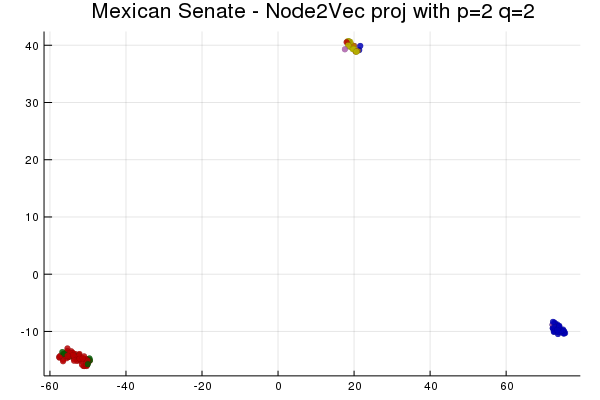
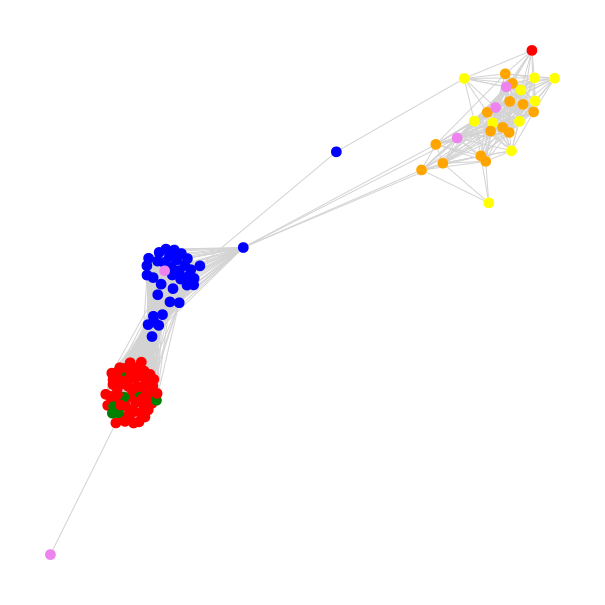

[](https://travis-ci.com/ollin18/Node2Vec.jl)
[](https://codecov.io/gh/ollin18/Node2Vec.jl)

# Node2Vec.jl

### Installation

```julia
] add https://github.com/ollin18/Node2Vec.jl
```

This is a Julia implementation of [Node2Vec](https://cs.stanford.edu/people/jure/pubs/node2vec-kdd16.pdf) with [SimpleWeightedGraphs](https://github.com/JuliaGraphs/SimpleWeightedGraphs.jl) which is built upon [LightGraphs](https://github.com/JuliaGraphs/LightGraphs.jl).

Node2Vec is an algorithm for network feature learning via biased random walks which we could describe as phrases with each visited node being a word. With that analogy we can easily see that the following step is to perform a Word2Vec Skip-gram approach to embed our nodes in a vector space. Is also to be noted that Node2Vec is a generalization of [DeepWalk](https://arxiv.org/pdf/1403.6652.pdf) setting `p=q=1`.

The implementation is stable but I'm still refactoring and writing documentation. It needs the LightGraphs and SimpleWeightedGraphs packages to get the weighted network structure and it is  very simple as we only have three functions, `node2vec_walk, simulate_walks, learn_embeddings`.

### Example

First we read the data

```julia
using TSne, Plots, Colors, GraphPlot, LightGraphs, SimpleWeightedGraphs,DelimitedFiles, StatsBase, Node2Vec

tred=readdlm("data/networks/adyacencias.csv",'|')
Nodes=readdlm("data/networks/los_nombres.csv",',')
sen=readdlm("data/networks/senators.csv",'|')
partidos=readdlm("data/networks/los_partidos.csv",'|')
```

Then we can create our network; build a dictionary with the node names and add the edges.

```julia
dic_nodes = Dict{String,Int64}(Dict(Nodes[i]=>i for i in 1:length(Nodes)))
g = SimpleWeightedGraph()
G = Graph()
last_node = Int64(length(Nodes))
add_vertices!(g,last_node)
add_vertices!(G,last_node)
for n in
    1:Int64(size(tred)[1])
    add_edge!(g,dic_nodes[tred[n,1]],
              dic_nodes[tred[n,2]],
              tred[n,3])
    add_edge!(G,dic_nodes[tred[n,1]],
              dic_nodes[tred[n,2]])
end
```

Now the Node2Vec algorithm. First the walks

```julia
# simulate_walks(network,num,length,p,q)
walks=simulate_walks(g,5,80,2,2)
```

It is possible to create your own simulated walks with `node2vec_walk(network,node,length,p,q)`, the function `simulate_walks` randomly shuffles the initial node to avoid the [first-mover advantage](https://journals.aps.org/pre/abstract/10.1103/PhysRevE.95.052301).

Then we do the Word2Vec step through [Word2Vec.jl](https://github.com/JuliaText/Word2Vec.jl). It strangely takes the character "</s>" as a word so we cut it.

```julia
model=learn_embeddings(walks)
vectors=model.vectors
```

In order to plot the embedded network we need to perform a dimensionality reduction (working on the parameters)

```julia
vectors=model.vectors
senators=vectors[:,2:size(vectors)[2]]
dv=tsne(senators')
```

The current network is a representation of the Mexican Senate so we want to color each node projection by their party affiliation.

```julia
get_order=Array{String}(undef,128)
for j in 1:128
   for i in 1:128
       if sen[i,2]==Nodes[j]
           get_order[j]=sen[i,3]
       end
   end
end

the_nodes=model.vocab[2:end]
nodes_num = map(x->parse(Int64,x),the_nodes)
ord_party=Array{Any}(undef,128)
for i in eachindex(nodes_num)
    ord_party[i]=get_order[nodes_num[i]]
end

for i in 1:size(ord_party)[1]
    if ord_party[i]=="PRI"
        ord_party[i]=1
    elseif ord_party[i]=="PAN"
        ord_party[i]=2
    elseif ord_party[i]=="PRD"
        ord_party[i]=3
    elseif ord_party[i]=="PVEM"
        ord_party[i]=4
    elseif ord_party[i]=="PT"
        ord_party[i]=5
    elseif ord_party[i]=="Independiente"
        ord_party[i]=6
    end
end
nodecolor = [colorant"red",colorant"blue",colorant"yellow",colorant"green",colorant"orange",colorant"violet"]
nodefillc =  nodecolor[ord_party]
```

Now we can finally plot the projection

```julia
scatter(dv[:,1],dv[:,2],legend=false,color=nodefillc,markersize=4,
        markerstrokewidth=0.3,alpha=0.6,show=true)
title!("Mexican Senate - Node2Vec proj with p=2 q=2")
```


And compare to the original network (with an unweighted LightGraphs network)

```julia
gplot(G,nodefillc=nodefillc,layout=spring_layout)
```


## Citing

If you find node2vec useful in your research, we ask that you cite the original paper:

    @inproceedings{Grover:2016:NSF:2939672.2939754,
        author = {Grover, Aditya and Leskovec, Jure},
        title = {Node2Vec: Scalable Feature Learning for Networks},
        booktitle = {Proceedings of the 22Nd ACM SIGKDD International Conference on Knowledge Discovery and Data Mining},
        series = {KDD '16},
        year = {2016},
        isbn = {978-1-4503-4232-2},
        location = {San Francisco, California, USA},
        pages = {855--864},
        numpages = {10},
        url = {http://doi.acm.org/10.1145/2939672.2939754},
        doi = {10.1145/2939672.2939754},
        acmid = {2939754},
        publisher = {ACM},
        address = {New York, NY, USA},
        keywords = {feature learning, graph representations, information networks, node embeddings},
    }
